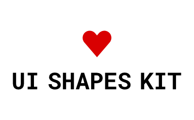
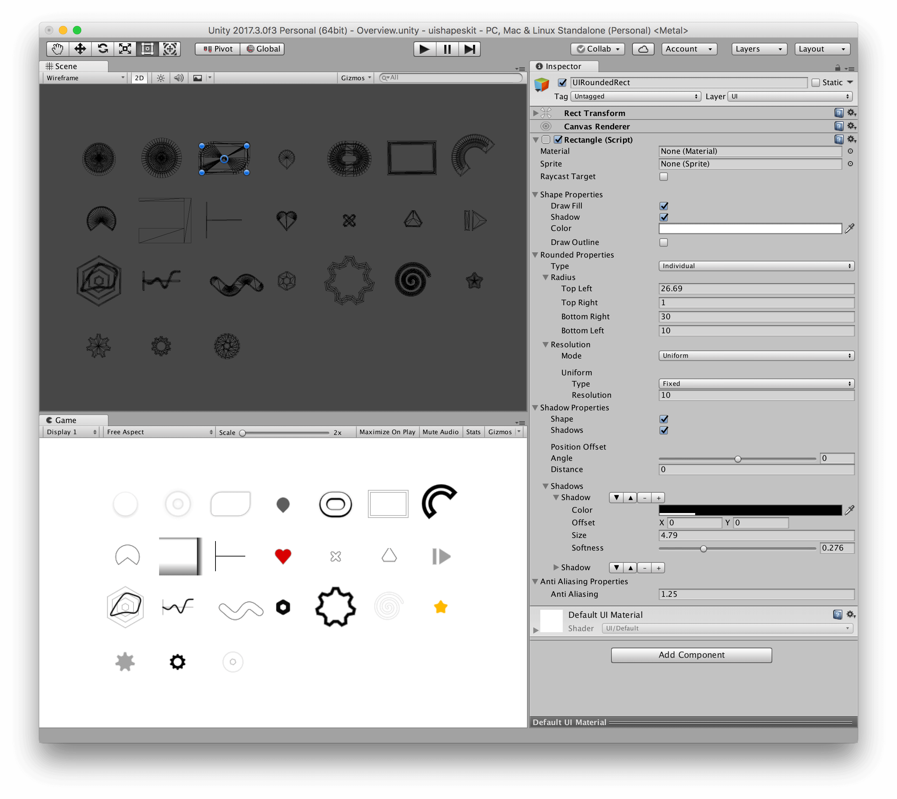
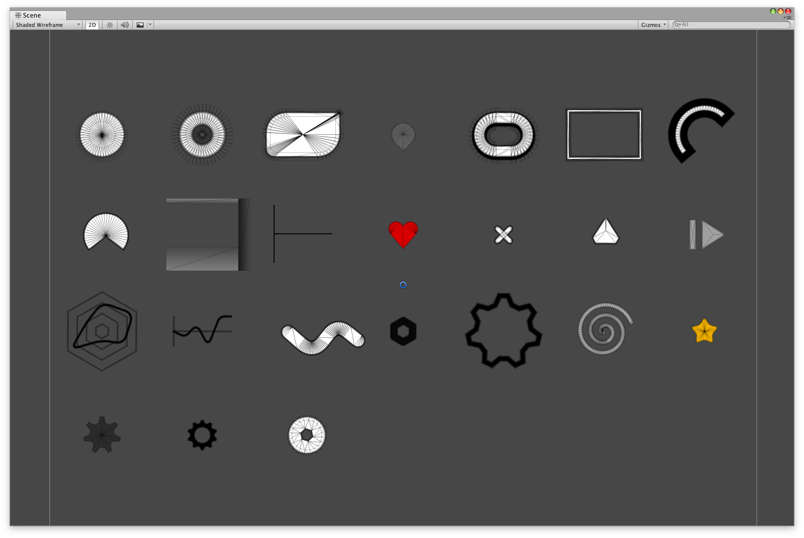

_Note_ This is a forked version of the [original repo](https://github.com/thisotherthing/ui-shapes-kit) modified for UPM without much other changes.

# UI Shapes Kit

create and edit UI directly in the editor, without the need for textures

## Features

- create flat ui without textures
- resolution independent
- geometry based anti-aliasing
- geometry based shadows/glows
- custom Editor and Property Drawers
- clean geometry
- basic UVs

## Supported Shapes

- Rectangles (with sharp and rounded corners)
- Ellipses
- Rings
- Arcs
- Lines (close/projected/rounded caps and corner rounding)
- N-gons (with corner rounding)
- Pixel-Perfect Lines
- 2 Color Gradients
- Empty Graphic to use as a Raycast Target

## Documentation

[Online Documentation](http://uishapeskit.thisotherthing.co/home/)

## Images

## Videos

Demo

Wireframe Demo

## License

UI Shapes Kit is available under the [MIT License](LICENSE.md). This means that you can use it in any commercial or noncommercial project. The only requirement is that you need to include attribution in your game's docs. A credit would be very, very nice, too, but isn't required. If you'd like to know more about what this license lets you do tldrlegal.com have a [very nice write up about the MIT license](https://tldrlegal.com/license/mit-license) that you might find useful.

UI Shapes Kit was originally created by [this other thing](https://www.thisotherthing.co/)
